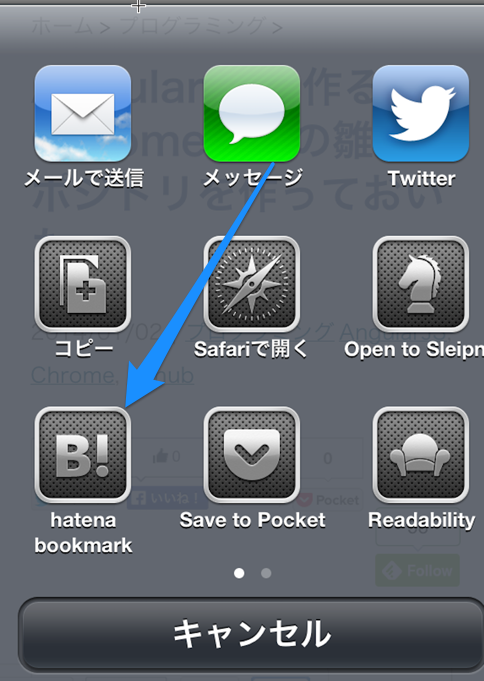

# HatenaBookmarkActivity

## Usage

    NSArray* activityItems = [NSArray arrayWithObjects:
                              self.post.title,
                              self.post.url,
                              nil];

    HatenaBookmarkActivity* hatenaBookmarkActivity = [[HatenaBookmarkActivity alloc] initWithBackURL:[NSURL URLWithString:@"memoblog://"]];

    UIActivityViewController *activityView = [[UIActivityViewController alloc]
                                               initWithActivityItems:activityItems
                                               applicationActivities:@[
                                                                       hatenaBookmarkActivity
                                                                       ]
                                              ];

    [self presentViewController:activityView animated:YES completion:^{

    }];

